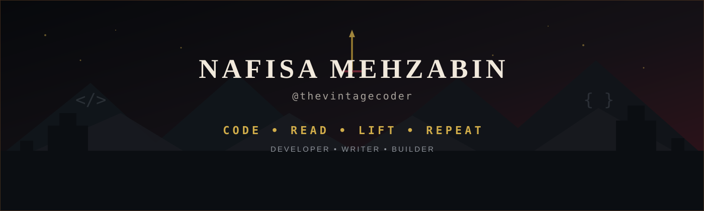

<!-- ═══════════════════════════════  BANNER  ═══════════════════════════════ -->

  

 

<!-- ═══════════════════════════════  INTRO  ═══════════════════════════════ -->

# NAFISA MEHZABIN

**`@thevintagecoder`**

### CODE • READ • LIFT • REPEAT

`Developer` · `Computer Science Student` · `Writer` · `Builder`

 

  

&nbsp;

 

---

<!-- ═══════════════════════════════  ABOUT  ═══════════════════════════════ -->

## 🗝️ About Me

Computer Science student who likes turning ideas into things people can actually use.

- 🛠️ Building mobile, web, and experimental projects while learning by shipping.
- ✍️ Writing about programming, projects, and lessons learned on [Medium](https://medium.com/@thevintagecoder).
- 📚 Usually reading something when I am away from the editor.
- 🏋️ Strength training keeps me consistent outside the codebase too.
- 🌱 Currently learning **Spring Boot**, **React**, and **Retrieval-Augmented Generation (RAG)**.

 

---

<!-- ═══════════════════════════════  TECH ARSENAL  ═══════════════════════════════ -->

## ⚔️ Tech Arsenal

**Languages**

  

**Frameworks & Development**

  

**Tools**

  

**Currently Learning**

&nbsp;

 

---

<!-- ═══════════════════════════════  PROJECTS  ═══════════════════════════════ -->

## 🏰 Current Quests

<!--
Bismillah Pomodoro is included below as requested.
If this repository is private, unpublished, or named differently, GitHub Readme Stats
will not be able to render the card publicly until the repository is accessible.
-->

  <a href="https://github.com/thevintagecoder?tab=repositories">Browse the full armoury →</a>

 

---

<!-- ═══════════════════════════════  WRITING  ═══════════════════════════════ -->

## ✍️ From My Quill

Long-form notes on what I build, break, and learn.

<!-- BLOG-POST-LIST:START -->
<!-- BLOG-POST-LIST:END -->

<a href="https://medium.com/@thevintagecoder">Read all scrolls →</a>

 

---

<!-- ═══════════════════════════════  PERSONAL  ═══════════════════════════════ -->

## 📚 Beyond the Code

- 📖 **Currently reading** — *The Inmate* by **Freida McFadden**
- 🏋️ **Lifting** — consistency, strength, progressive overload
- 🪽 **Attack on Titan** — Levi, the Scouts, and stories that refuse to pull their punches
- 🐺 **Game of Thrones** — House Stark, impossible choices, and world-building I can get lost in

 

<b>The North Remembers.</b>

 

---

<!-- ═══════════════════════════════  STATS  ═══════════════════════════════ -->

  

## 🔥 Battle Stats

 

<!-- ═══════════════════════════════  CONTRIBUTION SNAKE  ═══════════════════════════════ -->

<picture>
  <source media="(prefers-color-scheme: dark)" srcset="https://raw.githubusercontent.com/thevintagecoder/thevintagecoder/output/github-snake-dark.svg" />
  <source media="(prefers-color-scheme: light)" srcset="https://raw.githubusercontent.com/thevintagecoder/thevintagecoder/output/github-snake.svg" />
  
</picture>

 

---

<!-- ═══════════════════════════════  FOOTER  ═══════════════════════════════ -->

## 🐦 Send a Raven

&nbsp;

  

**CODE • READ • LIFT • REPEAT**

