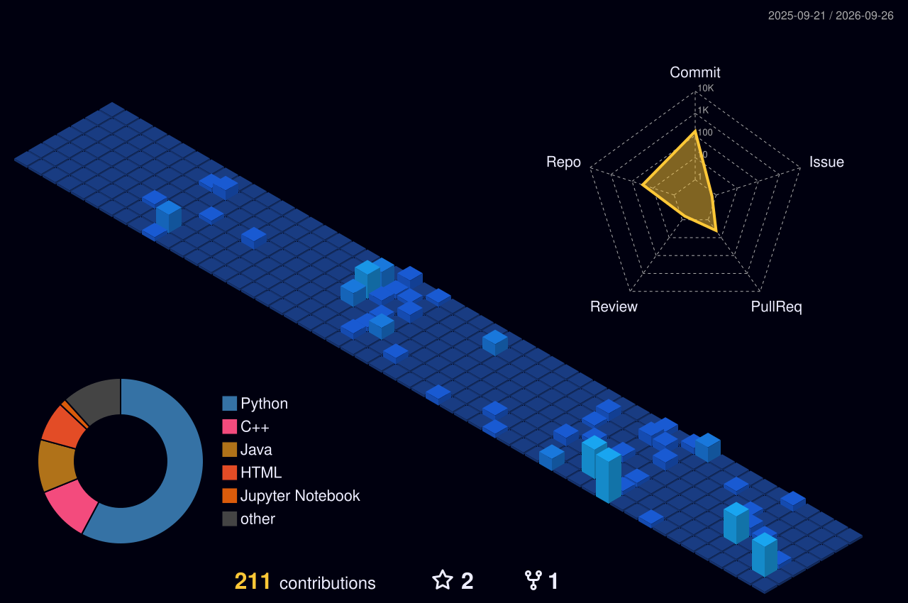

<!-- ═══════════════════════════════  ANIMATED BANNER  ═══════════════════════════════ -->

<div align="center">

  

</div>

<br />

<!-- ═══════════════════════════════  INTRO  ═══════════════════════════════ -->

<div align="center">

<h1>NAFISA MEHZABIN</h1>

<h3><code>@thevintagecoder</code></h3>


<p>

  <b>Developer</b> ·

  <b>Computer Science Student</b> ·

  <b>Writer</b> ·

  <b>Builder</b>

</p>

<br />

<a href="https://www.linkedin.com/in/nafisa-mehzabin-5460a7257/">

  

</a>

&nbsp;&nbsp;

<a href="https://medium.com/@thevintagecoder">

  

</a>

</div>

<br />

<div align="center">

  

</div>

<!-- ═══════════════════════════════  THE CHRONICLE  ═══════════════════════════════ -->

<div align="center">

  <h1>⚔️ THE CHRONICLE</h1>

</div>

Computer Science student building projects, writing about what I learn, and collecting new skills along the way.

- 🏰 **Developer** — turning ideas into mobile, web, and experimental projects.

- 📜 **Writer** — documenting projects, lessons, and discoveries on [Medium](https://medium.com/@thevintagecoder).

- 📚 **Reader** — usually somewhere between *one more chapter* and finishing the whole book.

- 🏋️ **Lifter** — consistency in the gym, consistency in the codebase.

- 🧭 **Currently exploring** — **Spring Boot**, **React**, and **Retrieval-Augmented Generation (RAG)**.

<br />

<div align="center">


<br /><br />

<h3>🐺 THE NORTH REMEMBERS.</h3>

</div>

<br />

---

<!-- ═══════════════════════════════  THE ARSENAL  ═══════════════════════════════ -->

<div align="center">

  <h1>🗡️ THE ARSENAL</h1>

  <h3>LANGUAGES</h3>

  

  <br /><br />

  <h3>FRAMEWORKS & DEVELOPMENT</h3>

  

  <br /><br />

  <h3>TOOLS OF THE TRADE</h3>

  

  <br /><br />

  <h3>CURRENTLY FORGING</h3>

  

  <br /><br />

  

</div>

<br />

<div align="center">

  

</div>

<!-- ═══════════════════════════════  QUESTS OF THE REALM  ═══════════════════════════════ -->

<div align="center">

  <h1>🏰 QUESTS OF THE REALM</h1>

</div>

<table>

<tr>

<td width="50%" valign="top">

<h2 align="center">🖐️ TempleGestures</h2>

<p align="center">

Turn <b>Temple Run</b> into a gesture-controlled game using computer vision and your webcam.

</p>

<p align="center"><code>Python</code> · <code>OpenCV</code> · <code>MediaPipe</code> · <code>PyAutoGUI</code></p>

<p align="center">

<a href="https://github.com/thevintagecoder/TempleGestures">

  

</a>

</p>

</td>

<td width="50%" valign="top">

<h2 align="center">🐉 GoT Survival Predictor</h2>

<p align="center">

A beginner machine-learning project that predicts whether a fictional <b>Game of Thrones-inspired character survives</b>.

</p>

<p align="center"><code>Machine Learning</code> · <code>Python</code> · <code>Jupyter Notebook</code></p>

<p align="center">

<a href="https://github.com/thevintagecoder/game-of-thrones-survival-predictor">

  

</a>

</p>

</td>

</tr>

<tr>

<td width="50%" valign="top">

<h2 align="center">⏳ Bismillah Pomodoro</h2>

<p align="center">

A Pomodoro project built around focused work, consistency, and getting things done one session at a time.

</p>

<p align="center">

<a href="https://github.com/thevintagecoder/bismillah-pomodoro">

  

</a>

</p>

</td>

<td width="50%" valign="top">

<h2 align="center">🌲 Ghibli Forest Theme</h2>

<p align="center">

A <b>Studio Ghibli-themed VS Code extension</b> bringing a forest-inspired atmosphere into the editor.

</p>

<p align="center"><code>VS Code Extension</code> · <code>Theme</code></p>

<p align="center">

<a href="https://github.com/thevintagecoder/ghibli-forest-theme-vscode-extension">

  

</a>

</p>

</td>

</tr>

</table>

<div align="center">

<br />

<a href="https://github.com/thevintagecoder?tab=repositories">

  

</a>

</div>

<br />

---

<!-- ═══════════════════════════════  THE CITADEL  ═══════════════════════════════ -->

<div align="center">

  <h1>📜 DISPATCHES FROM THE CITADEL</h1>

  <h3>Things I build, break, learn, and eventually write down.</h3>

  <p><b>Automatically refreshed from my Medium feed.</b></p>

</div>

<!-- BLOG-POST-LIST:START -->
<p>🐉 <a href="https://medium.com/@thevintagecoder/building-a-game-of-thrones-inspired-survival-predictor-as-a-beginner-machine-learning-project-dd86388d539d"><b>Building a Game of Thrones-Inspired Survival Predictor as a Beginner Machine Learning Project</b></a></p>

<p>🖐️ <a href="https://medium.com/@thevintagecoder/how-to-turn-your-webcam-into-a-game-controller-a-beginners-guide-to-computer-vision-ca6ec5753a47"><b>How to Turn Your Webcam into a Game Controller: A Beginner’s Guide to Computer Vision</b></a></p>

<p>☕ <a href="https://medium.com/@thevintagecoder/stop-clicking-run-a-step-by-step-guide-to-learning-java-the-real-way-with-sublime-text-and-the-7a0b1ea6ae8d"><b>Stop Clicking “Run”: A Step-by-Step Guide to Learning Java the Real Way with Sublime Text and the Terminal</b></a></p>

<p>🏰 <a href="https://medium.com/@thevintagecoder/walk-before-you-run-how-to-start-coding-without-the-setup-anxiety-780ab4c1b5b6"><b>Walk Before You Run: How to Start Coding Without the “Setup Anxiety”</b></a></p>
<!-- BLOG-POST-LIST:END -->

<br />

<div align="center">

<a href="https://medium.com/@thevintagecoder">

  

</a>

</div>

<br />

<div align="center">

  

</div>

<!-- ═══════════════════════════════  BEYOND THE WALL  ═══════════════════════════════ -->

<div align="center">

  <h1>🐺 LIFE BEYOND THE WALL</h1>

</div>

<table>

<tr>

<td width="50%" valign="top">

<h2 align="center">📚 THE LIBRARY</h2>

<p align="center"><b>Currently reading</b></p>

<p align="center"><i>The Inmate</i><br />by <b>Freida McFadden</b></p>

<p align="center">Books are usually what happens when the laptop finally closes.</p>

</td>

<td width="50%" valign="top">

<h2 align="center">🏋️ THE TRAINING GROUNDS</h2>

<p align="center"><b>Strength, consistency, and progressive overload.</b></p>

```bash

git commit -m "progressive overload"

```

<p align="center">The training arc continues.</p>

</td>

</tr>

</table>

<br />

---

<!-- ═══════════════════════════════  FIRE AND BLOOD  ═══════════════════════════════ -->

<div align="center">


<br />

<h1>🔥 FIRE AND BLOOD</h1>

</div>

<br />

<div align="center">

  

</div>

<!-- ═══════════════════════════════  WAR RECORDS  ═══════════════════════════════ -->

<div align="center">

  <h1>⚔️ WAR RECORDS</h1>

  

  &nbsp;

  

  &nbsp;

  <a href="https://github.com/thevintagecoder?tab=repositories">

    

  </a>

</div>

<br />

---

<!-- ═══════════════════════════════  3D REALM  ═══════════════════════════════ -->

<div align="center">

<h1>🗺️ THE SEVEN KINGDOMS OF CODE</h1>

<h3><i>My contribution history, raised into a 3D realm.</i></h3>

<br />



<br />

<sub>If this is blank after your first push, run the <b>GitHub-Profile-3D-Contrib</b> workflow once from the Actions tab.</sub>

</div>

<br />

---

<!-- ═══════════════════════════════  FIERY WAR MAP  ═══════════════════════════════ -->

<div align="center">

<h1>🐉 THE WAR MAP</h1>

<h3><i>Every square marks another battle fought in the realm of code.</i></h3>

<br />

<picture>

  <source

    media="(prefers-color-scheme: dark)"

    srcset="https://raw.githubusercontent.com/thevintagecoder/thevintagecoder/output/github-snake-dark.svg"

  />

  <source

    media="(prefers-color-scheme: light)"

    srcset="https://raw.githubusercontent.com/thevintagecoder/thevintagecoder/output/github-snake.svg"

  />

  

</picture>

<br /><br />

<h3>🔥 THE REALM GROWS ONE COMMIT AT A TIME.</h3>

</div>

<br />

<div align="center">

  

</div>

<!-- ═══════════════════════════════  SEND A RAVEN  ═══════════════════════════════ -->

<div align="center">

<h1>🐦 SEND A RAVEN</h1>

<h3><i>The ravens know where to find me.</i></h3>

<br />

<a href="https://www.linkedin.com/in/nafisa-mehzabin-5460a7257/">

  

</a>

&nbsp;&nbsp;

<a href="https://medium.com/@thevintagecoder">

  

</a>

<br /><br />

<h2>CODE • READ • LIFT • REPEAT</h2>

<p><b>Built somewhere between the Citadel and the North.</b></p>

</div>